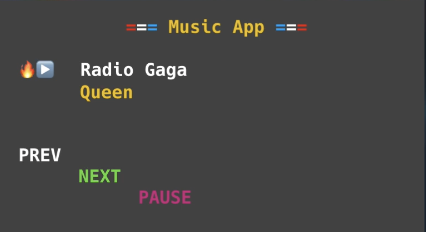
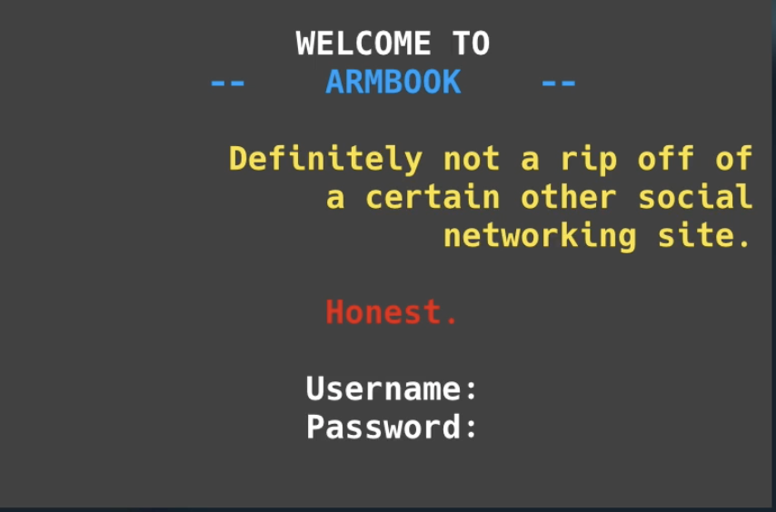

# 👉 Day 31 Challenge

- Create a classic user interface using string manipulation. 

- Create these two user interfaces (below) using everything you know about extensions to `print` statements and f-strings.

- The second one is a bit more tricky as it involves alignment.

- There are no input statements. This is all about using `print` and variables in interesting ways. However, you may want to create a subroutine to make the color changing easier (like you did on Day 29).

Interface 1:

Interface 2:

 
 💡 Hints 

- Create a subroutine to define your colors. It can be very similar to the subroutine you used on Day 29.
- Assign variables to the title, text, and words like "prev", "next", "username", etc. to make it easier to align the text.
- You will need f-strings anytime you include a variable and text alignment and a string together.
  

